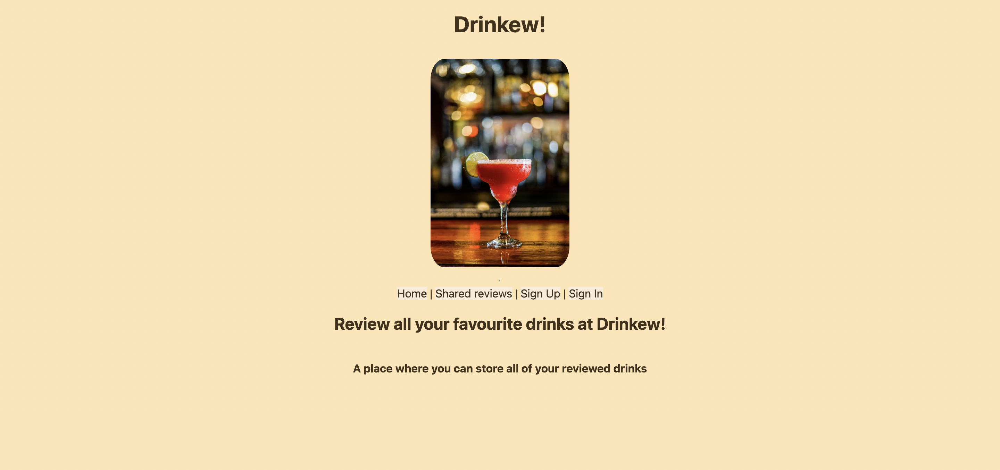
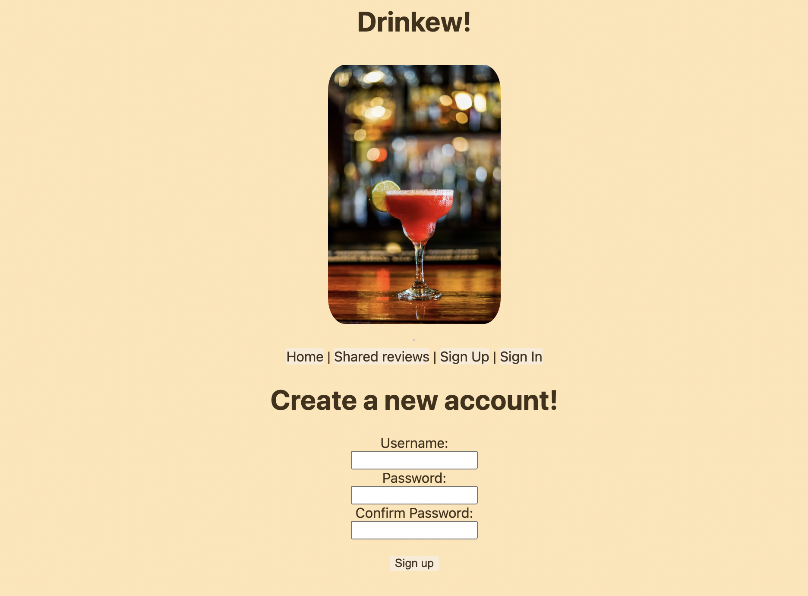
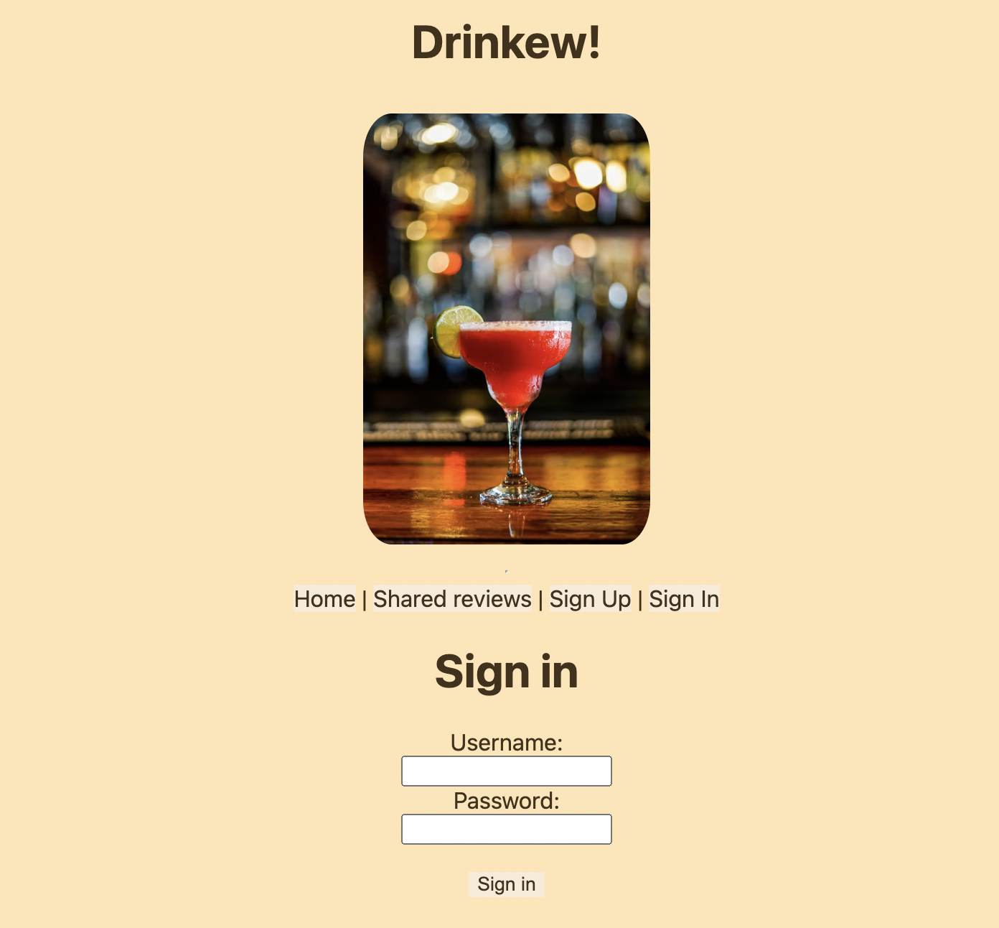
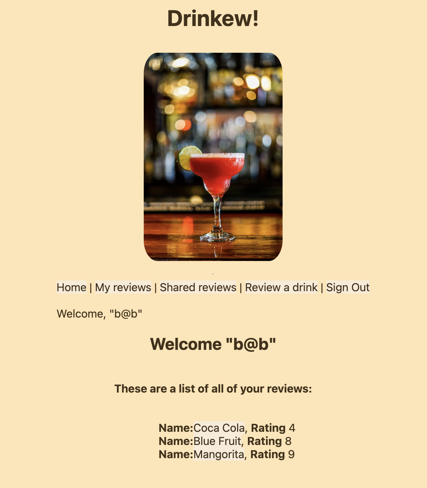
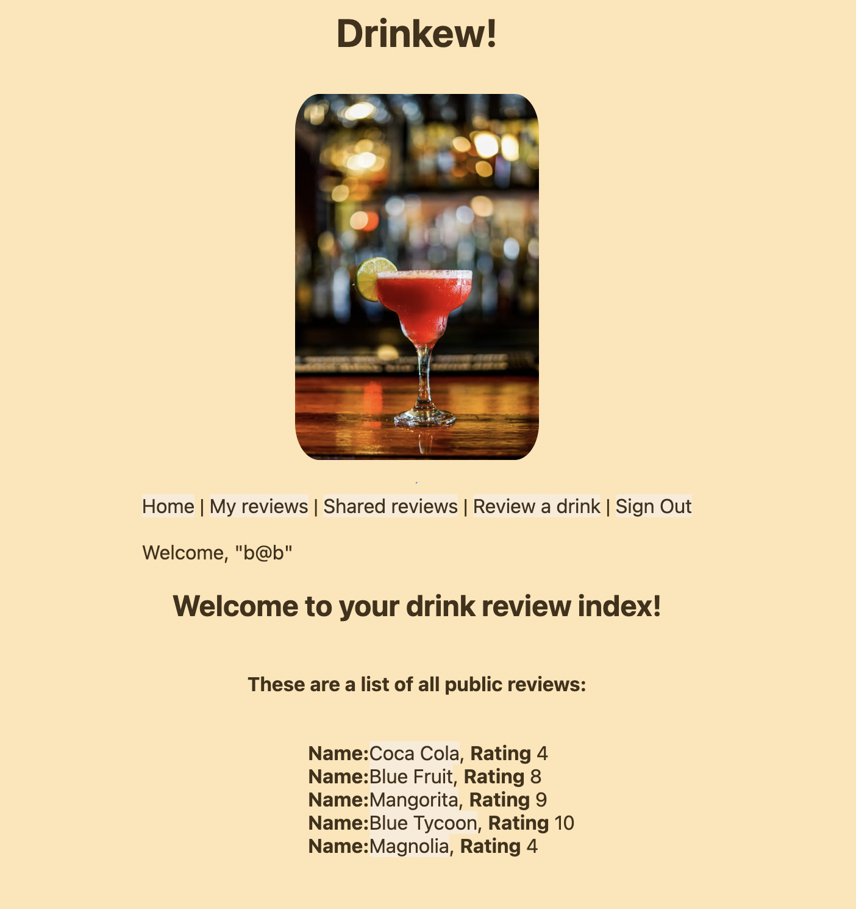
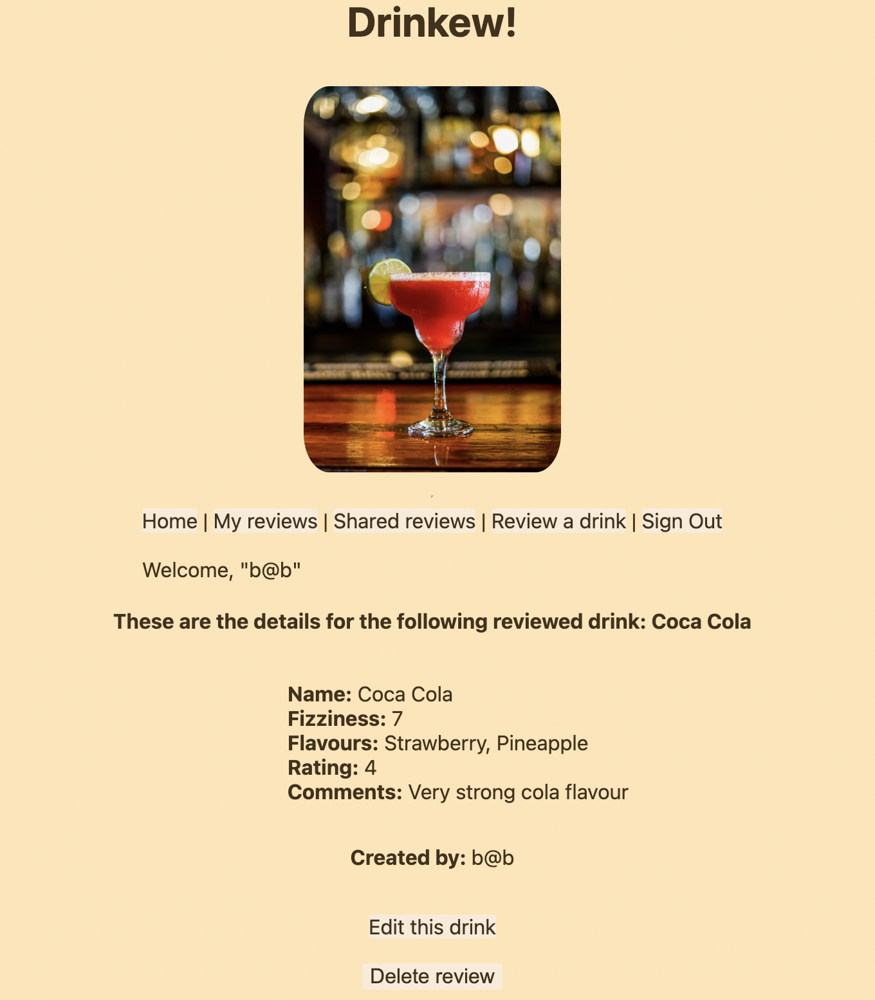
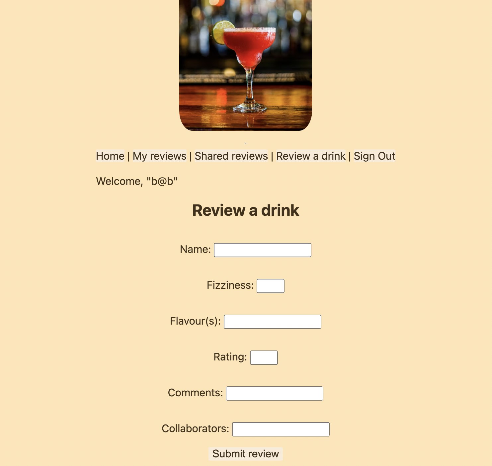
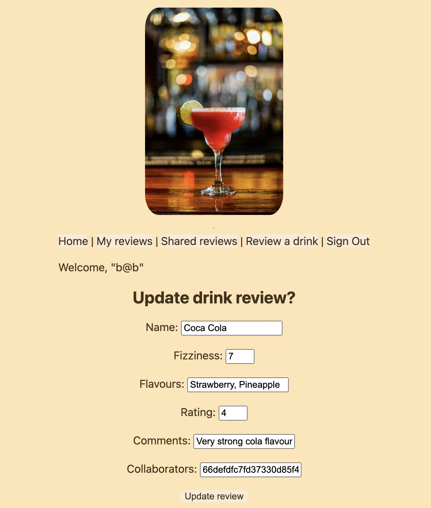
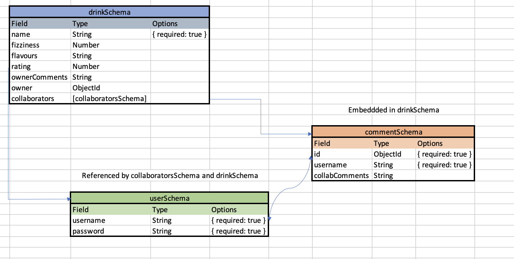

# Drinkew

## Summary

Welcome to Drinkew! Ever wanted to remember that amazing cocktail you tried last weekend? Well now you can!

Drinkew is a place for users to share reviews of drinks they've tried and invite their friends to join the fun! _Sign Up now to start reviewing!_

## Getting Started

You can access the deployed app which is hosted at [render.com](https://render.com/) at this link [https://drinkew.onrender.com/](https://drinkew.onrender.com/)

To view the planning materials please message me on [my profile](https://www.linkedin.com/public-profile/settings?trk=d_flagship3_profile_self_view_public_profile) as this consisted of hardwritten notes and diagrams. See the Appendix for an example ERD (which was not ultimately used). You can also see my Trello board here: https://trello.com/invite/b/66e43a2f89de8fab601da444/ATTI0809256902afe14bc7b241f2f29036ed8A9FC06D/drinkew 

## Table of Contents

- [Tech-Stack](#tech-stack)
- [Usage](#usage)
  - [Sign Up](#sign-up)
  - [Sign In](#sign-in)
  - [My Reviews](#my-reviews)
  - [Shared Reviews](#shared-reviews)
  - [Details](#details)
  - [Create a Review](#create-review)
  - [Update a Review](#update-review)
- [Ownership](#ownership)
- [Next Steps](#nextsteps)
- [License](#license)
- [Appendix](#appendix)

### Technology Stack

- [Mongoose](https://mongoosejs.com/docs/)
- [Express](https://expressjs.com/)
- [Node.js](https://nodejs.org/en)

## How to Use

## Sign Up

Create a username and password for an account to join the community of reviewers!

## Sign In

Once you've created an account, sign in and start reviewing drinks.

## My Reviews

Want to find a drink that you've personally reviewed? At the My Reviews page, all your previous reviews.

## Shared Reviews

Our current model is an open user community, all reviews created by any users can be found here!

## Details

They say that the devil is in the details, come to this page if you want to know the details of a review.

## Create Review

This is where the magic happens. Get your beverage lined up and your phone handy to submit a drink review and record characteristics such as fizziness, the different flavours and give it an overall rating!

## Update Review

Made a mistake? Do not fret - that's what this page is for! Edit and update any of the review fields. You can even allow other users to edit your review if you list their username as a collaborator.

## Ownership

The user that creates a review becomes the _owner_ of that review and has both edit and delete privileges. At the point of creation or editing, you can also add other '_collaborators_'. A collaborator can edit a review of which they are a listed collaborator but they cannot delete that review. Each review can have multiple collaborators but only one owner.

## Next Steps

- Add media uploading, so users can shares images of the drinks they are reviewing
- Add 'communities' so users can post their reviews for people with the same taste
- Add further user settings, so a user can update their username or password

## License

This website is licensed under the [Tongan Government](https://www.youtube.com/watch?v=xvFZjo5PgG0)

## Appendix

